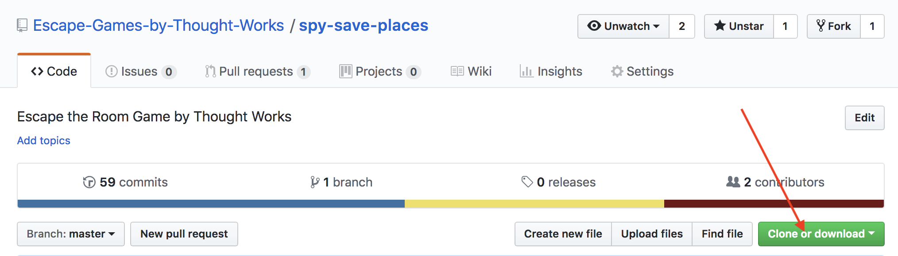
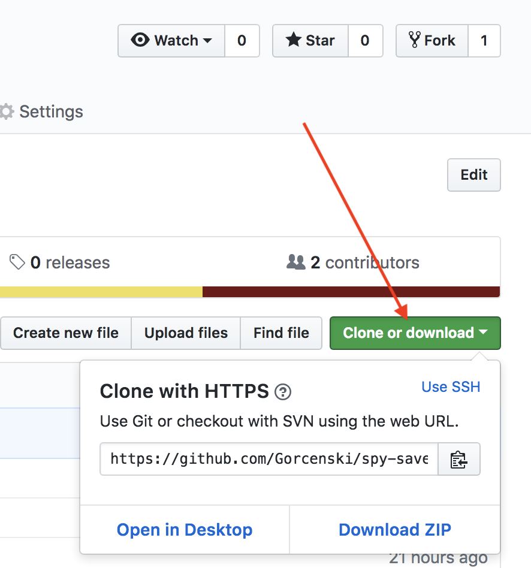
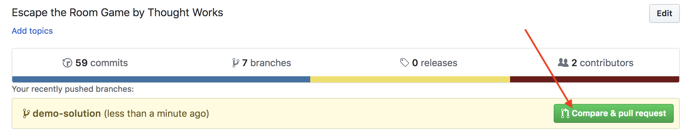
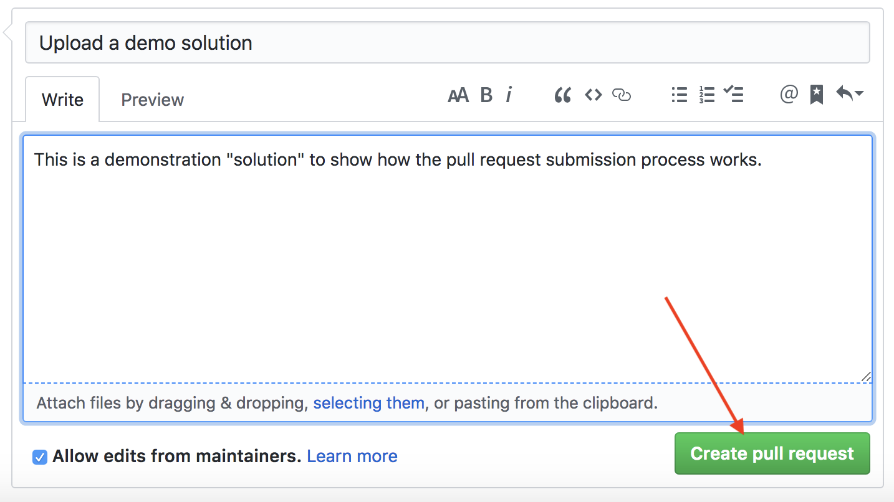
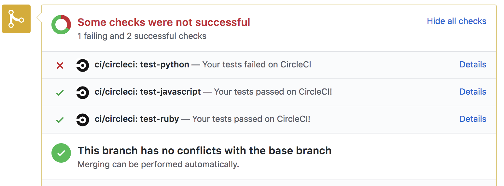

# Code Challenge: Spy save places

We prepared repositories with test-suites for different coding languages. In order to solve the challenge, pick one of the favorite language and write the functions, so that all tests in the test-suites get green.

To begin, fork this repository and checkout your fork.

Next, create a branch for your solution. Name it something descriptive, e.g. "sarahs-python-solution." Work in this branch and commit your changes as normal.

When you are ready to submit a solution, open a Pull Request from your branch to the master branch of this repository. When you open the pull request, you should see if your tests pass or not. Be sure to give the pull request a meaningful title, and write a thorough description so your submissions are easier to review!

If your tests fail, don't worry, you can keep working to fix any issues! To do so, make changes and create and push a new commit in your branch. Your pull request will reflect these changes automatically. Remember that you can run tests locally before submitting a pull request.

